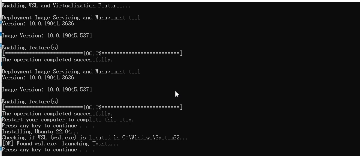

## 1. Unlocking features and install wsl2

### 1.1 use install bat to install wsl2
Open wsl_install.bat as an administrator.

- Right click -> Run as administrator...

You should see: 




If you cannot run this file successfully, try:

Go to microsoft store and install [ubuntu-22.04](https://apps.microsoft.com/detail/9pn20msr04dw?ocid=webpdpshare)

### 1.2 reboot
Before moving forward, make sure you reboot your computer so that Windows 11 will have WSL2 and virtualization available to it.

## 2. Init wsl2 environment

[wsl2 image](https://drive.google.com/file/d/1OK2Sd2Ylwd1J3cMOLr_SgYnhmDdidtOl/view?usp=sharing)

### import wsl2 environment
```bash
wsl --import ivry-cli path\to\your\wsl\path path\to\backup.tar
```
example:
```bash
wsl --import ivry-cli C:\WSL\Ubuntu C:\User\Downloads\ivry-cli.tar
```

get into the wsl2 environment
```bash
wsl -d ivry-cli
```


## 3. Get into ivry_cli

check ivry_cli:
```bash
cd /opt/ivry_cli
```
```bash
source venv/bin/activate
```
```bash
ivry_cli
```

## 4. pull project from ivry website

### Make sure your comfyUI dir is in " "
```bash
ivry_cli pull_project --app_id your_app_id --comfyUI_dir "your_comfyUI_dir"
#ivry_cli pull_project --app_id 48 --comfyUI_dir "C:\Users\playtime\Desktop\ComfyUI_windows_portable\ComfyUI"
```

## 5. host your project
### project name is "app_" + your app id
```bash
ivry_cli run_server --project app_id --force
#ivry_cli run_server --project app_48 --force
```

